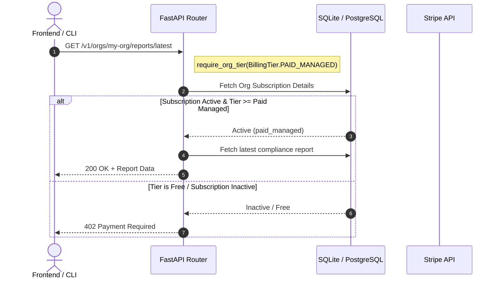
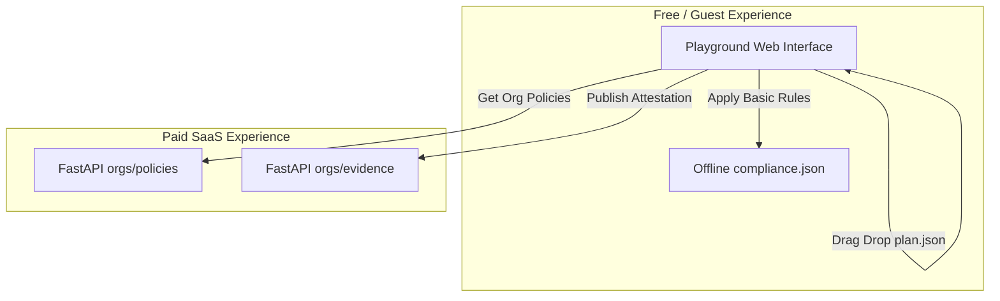

# ReadThePlan (RTP) Cloud: Paid-Tier Feature Gating & Playground Integration Design

This document details the practical v1 UI and backend architecture for integrating Stripe billing, paid-tier feature gating, and the client-side Playground into the **ReadThePlan (RTP) Cloud** SaaS platform. 

---

## 1. Architectural Overview & Tier Gating Strategy

RTP Cloud operates on a hybrid client-secure model. The open-source (OSS) local CLI analyzes plans locally for privacy, while the SaaS platform acts as the managed compliance and evidence pipeline (storing signed attestations, policy profiles, and generating audit-ready reports).

### The Three-Tier Model

| Tier | Target Audience | Key Features | Limits / Quotas | Gating Type |
| :--- | :--- | :--- | :--- | :--- |
| **Free OSS** | Local Developers | - Free local CLI<br>- Client-side Playground (public rules only) | - Local run only<br>- No cloud storage/attestation tracking | Fully Offline / No Backend Auth Needed |
| **Paid Managed** | Growth & Security Teams | - Organization policy profiles & overrides<br>- Signed Evidence Artifact timeline<br>- Custom policy-tuned analysis in Playground<br>- Compliance reports (SOC2, ISO27001)<br>- Support SLA | - Max 10 projects<br>- Max 5 members<br>- 30-day evidence retention | API Middleware & UI Feature Gates |
| **Enterprise** | Large Scale Compliance | - Private Connector (VPC peering/agent)<br>- Custom SSO/SAML Integration<br>- Audit logs export<br>- Extended/unlimited retention | - Unlimited projects<br>- Unlimited members<br>- Custom SLA | Contact Sales / Manual flag / Enterprise Auth |

---

## 2. Database Schema Changes

To support organization-scoped billing, subscription status tracking, and tier limits, the `organizations` table requires additional fields. Below are the SQL migration statements and SQLAlchemy models.

### SQLAlchemy Model Updates (Python)
Modify `cloud_api/models/organization.py` to include Stripe properties and active tier controls:

```python
# [MODIFY] cloud_api/models/organization.py

from enum import Enum
from sqlalchemy import String, DateTime, Enum as SQLEnum
from sqlalchemy.orm import Mapped, mapped_column

class BillingTier(str, Enum):
    FREE = "free"
    PAID_MANAGED = "paid_managed"
    ENTERPRISE = "enterprise"

class Organization(Base):
    __tablename__ = "organizations"

    # Existing fields
    id: Mapped[uuid.UUID] = mapped_column(primary_key=True, default=uuid.uuid4)
    name: Mapped[str] = mapped_column(String(255))
    slug: Mapped[str] = mapped_column(String(255), unique=True, index=True)
    created_at: Mapped[datetime] = mapped_column(default=utcnow)
    updated_at: Mapped[datetime] = mapped_column(default=utcnow, onupdate=utcnow)

    # Billing & Tier Gating fields
    billing_tier: Mapped[BillingTier] = mapped_column(
        SQLEnum(BillingTier),
        default=BillingTier.FREE,
        nullable=False
    )
    stripe_customer_id: Mapped[str | None] = mapped_column(
        String(255), 
        nullable=True, 
        unique=True, 
        index=True
    )
    stripe_subscription_id: Mapped[str | None] = mapped_column(
        String(255), 
        nullable=True, 
        unique=True
    )
    subscription_status: Mapped[str | None] = mapped_column(
        String(50), 
        nullable=True, 
        default="inactive" # active, past_due, canceled, trialing
    )
    subscription_period_end: Mapped[datetime | None] = mapped_column(
        DateTime, 
        nullable=True
    )
```

### SQL DDL Migration (Alembic)
```sql
CREATE TYPE billingtier AS ENUM ('free', 'paid_managed', 'enterprise');

ALTER TABLE organizations 
ADD COLUMN billing_tier billingtier NOT NULL DEFAULT 'free',
ADD COLUMN stripe_customer_id VARCHAR(255) UNIQUE DEFAULT NULL,
ADD COLUMN stripe_subscription_id VARCHAR(255) UNIQUE DEFAULT NULL,
ADD COLUMN subscription_status VARCHAR(50) DEFAULT 'inactive',
ADD COLUMN subscription_period_end TIMESTAMP WITH TIME ZONE DEFAULT NULL;

CREATE INDEX idx_orgs_stripe_customer ON organizations(stripe_customer_id);
```

---

## 3. Backend API Endpoints & Gating Middleware

The backend relies on the active subscription state to gate stateful endpoints (like saving evidence or fetching compliance reports).



### A. FastAPI Billing Router (`/v1/billing`)
Create a new file `cloud_api/routers/billing.py` to handle subscription checkout, self-service portals, and webhooks:

```python
# [NEW] cloud_api/routers/billing.py

import stripe
from fastapi import APIRouter, Depends, HTTPException, Header, Request, status
from sqlalchemy.orm import Session
from cloud_api.core.database import get_db
from cloud_api.core.config import settings
from cloud_api.core.deps import get_current_user_id, require_org_role
from cloud_api.models.membership import MembershipRole
from cloud_api.models.organization import Organization, BillingTier

stripe.api_key = settings.stripe_secret_key
router = APIRouter(prefix="/v1/orgs/{org_slug}/billing", tags=["billing"])

@router.post("/checkout")
def create_checkout_session(
    org_slug: str,
    price_id: str, # price_xxxx from Stripe Dashboard
    db: Session = Depends(get_db),
    user_id: str = Depends(require_org_role(MembershipRole.admin)),
):
    """Initiates a Stripe Checkout Session for upgrading an organization tier."""
    org = db.query(Organization).filter(Organization.slug == org_slug).first()
    
    # Check if Stripe customer exists, else create one
    if not org.stripe_customer_id:
        customer = stripe.Customer.create(
            name=org.name,
            metadata={"org_id": str(org.id), "org_slug": org.slug}
        )
        org.stripe_customer_id = customer.id
        db.commit()

    try:
        session = stripe.checkout.Session.create(
            customer=org.stripe_customer_id,
            payment_method_types=["card"],
            line_items=[{"price": price_id, "quantity": 1}],
            mode="subscription",
            success_url=f"{settings.frontend_url}/orgs/{org_slug}/billing?status=success",
            cancel_url=f"{settings.frontend_url}/orgs/{org_slug}/billing?status=canceled",
            metadata={"org_id": str(org.id)},
            subscription_data={"metadata": {"org_id": str(org.id)}}
        )
        return {"url": session.url}
    except Exception as e:
        raise HTTPException(status_code=500, detail=f"Stripe session creation failed: {str(e)}")

@router.post("/portal")
def create_portal_session(
    org_slug: str,
    db: Session = Depends(get_db),
    user_id: str = Depends(require_org_role(MembershipRole.admin)),
):
    """Creates a Stripe Billing Customer Portal session for subscription adjustments."""
    org = db.query(Organization).filter(Organization.slug == org_slug).first()
    if not org.stripe_customer_id:
        raise HTTPException(status_code=400, detail="No active billing record found.")

    try:
        session = stripe.billing_portal.Session.create(
            customer=org.stripe_customer_id,
            return_url=f"{settings.frontend_url}/orgs/{org_slug}/billing"
        )
        return {"url": session.url}
    except Exception as e:
        raise HTTPException(status_code=500, detail=f"Stripe portal redirection failed: {str(e)}")
```

### B. Stripe Webhook Router (`/v1/billing/webhook`)
Webhooks verify events asynchronously and keep local subscription records accurate. Place in `/v1/billing/webhook` (needs to be excluded from global CSRF check middleware):

```python
# [NEW] cloud_api/routers/webhooks.py

from fastapi import APIRouter, Depends, HTTPException, Header, Request, status
from sqlalchemy.orm import Session
from datetime import datetime
import stripe
from cloud_api.core.database import get_db
from cloud_api.core.config import settings
from cloud_api.models.organization import Organization, BillingTier

router = APIRouter(prefix="/v1/billing/webhook", tags=["webhooks"])

@router.post("/")
async def stripe_webhook(
    request: Request,
    sig_header: str = Header(None, alias="Stripe-Signature"),
    db: Session = Depends(get_db)
):
    payload = await request.body()
    try:
        event = stripe.Webhook.construct_event(
            payload, sig_header, settings.stripe_webhook_secret
        )
    except (ValueError, stripe.error.SignatureVerificationError) as e:
        raise HTTPException(status_code=400, detail="Invalid Stripe signature")

    event_type = event["type"]
    data_object = event["data"]["object"]

    if event_type in ["checkout.session.completed", "invoice.payment_succeeded"]:
        # Retrieve Org metadata
        org_id = data_object.get("metadata", {}).get("org_id")
        sub_id = data_object.get("subscription")
        cust_id = data_object.get("customer")
        
        if sub_id and org_id:
            sub = stripe.Subscription.retrieve(sub_id)
            org = db.query(Organization).filter(Organization.id == org_id).first()
            if org:
                org.stripe_customer_id = cust_id
                org.stripe_subscription_id = sub_id
                org.subscription_status = sub.status
                org.subscription_period_end = datetime.fromtimestamp(sub.current_period_end)
                
                # Determine Tier from Stripe Price Id
                price_id = sub["items"]["data"][0]["price"]["id"]
                if price_id == settings.stripe_enterprise_price_id:
                    org.billing_tier = BillingTier.ENTERPRISE
                else:
                    org.billing_tier = BillingTier.PAID_MANAGED
                db.commit()

    elif event_type == "customer.subscription.updated":
        sub_id = data_object["id"]
        sub = data_object
        org = db.query(Organization).filter(Organization.stripe_subscription_id == sub_id).first()
        if org:
            org.subscription_status = sub["status"]
            org.subscription_period_end = datetime.fromtimestamp(sub["current_period_end"])
            
            # Downgrade tier if status canceled
            if sub["status"] in ["canceled", "unpaid"]:
                org.billing_tier = BillingTier.FREE
            db.commit()

    elif event_type == "customer.subscription.deleted":
        sub_id = data_object["id"]
        org = db.query(Organization).filter(Organization.stripe_subscription_id == sub_id).first()
        if org:
            org.billing_tier = BillingTier.FREE
            org.subscription_status = "canceled"
            org.stripe_subscription_id = None
            db.commit()

    return {"status": "success"}
```

### C. FastAPI Tier Gating Middleware
Define a dependency in `cloud_api/core/deps.py` that can lock specific API paths:

```python
# [NEW] cloud_api/core/deps.py:require_org_tier

def require_org_tier(minimum_tier: BillingTier) -> Callable:
    """Enforces org-scoped feature gating based on active billing tier."""
    _tier_rank = {BillingTier.FREE: 0, BillingTier.PAID_MANAGED: 1, BillingTier.ENTERPRISE: 2}
    min_rank = _tier_rank[minimum_tier]

    def _check(
        org_slug: str,
        user_id: str = Depends(get_current_user_id),
        db: Session = Depends(get_db),
    ) -> Organization:
        # First ensure user is in organization
        org = db.query(Organization).filter(Organization.slug == org_slug).first()
        if not org:
            raise HTTPException(status_code=404, detail="Organization not found")
            
        membership = db.query(Membership).filter(
            Membership.organization_id == org.id, Membership.user_id == user_id
        ).first()
        if not membership:
            raise HTTPException(status_code=403, detail="Not a member of this organization")

        # Exclude expired subscriptions
        is_active = org.subscription_status in ["active", "trialing"]
        current_rank = _tier_rank[org.billing_tier] if is_active else 0

        if current_rank < min_rank:
            raise HTTPException(
                status_code=status.HTTP_402_PAYMENT_REQUIRED,
                detail=f"This feature requires a {minimum_tier.value.upper()} subscription tier."
            )
        return org

    return _check
```

*Example endpoint gating usage (locking Policy Profile customization or Report generation):*
```python
@router.post("/", status_code=201)
def generate_report(
    org_slug: str,
    db: Session = Depends(get_db),
    # Simply declare dependency to block free tier
    org: Organization = Depends(require_org_tier(BillingTier.PAID_MANAGED))
):
    ...
```

---

## 4. UI Design & Next.js 16 Cyberpunk Components

RTP Cloud sports a terminal-frame/cyberpunk Matrix aesthetic: dark gray (#0a0a0a), intense neon green primary controls (`#00ff41`), thin dark green borders (`#003300`), and CRT glass effects.

### A. Pricing Page (`app/pricing/page.tsx`)
A clean, premium grid presenting the core values of RTP, styled with CRT scanlines and terminal framing:

```tsx
// [NEW] app/pricing/page.tsx

"use client";

import Link from "next/link";

const pricingTiers = [
  {
    name: "FREE OSS",
    cost: "$0",
    period: "forever",
    description: "Ideal for individual developers running local validation.",
    features: [
      "Local CLI analysis run",
      "Standard client-side playground",
      "Public frameworks (SOC 2, ISO 27001)",
      "Zero plan uploads",
    ],
    cta: "Download CLI",
    href: "https://github.com/readtheplan/readtheplan",
    highlight: false,
  },
  {
    name: "PAID MANAGED",
    cost: "$49",
    period: "org / month",
    description: "Complete compliance audit evidence store for growing startups.",
    features: [
      "Custom Policy Profiles & overrides",
      "Signed Evidence Attestation timeline",
      "Policy-tuned in-browser Playground",
      "PDF/JSON compliance report builder",
      "Slack/GitHub Actions integrations",
      "Standard support SLA",
    ],
    cta: "Upgrade System",
    href: "/orgs",
    highlight: true,
  },
  {
    name: "ENTERPRISE",
    cost: "Custom",
    period: "contract",
    description: "Regulated organizations requiring private execution planes.",
    features: [
      "Private Connector (VPC Peering/Agent)",
      "SAML/SSO Single Sign-On",
      "Organization-wide compliance audit trails",
      "Continuous runtime drifts checks",
      "Premium 1hr SLA support",
    ],
    cta: "Secure Link",
    href: "mailto:sales@readtheplan.dev",
    highlight: false,
  },
];

export default function PricingPage() {
  return (
    <div className="max-w-6xl mx-auto px-6 py-16 space-y-12">
      {/* Visual Glitch Header */}
      <div className="text-center space-y-4">
        <div className="text-xs text-accent font-mono animate-pulse font-bold tracking-widest">
          SYSTEM_LICENSE_MARKETPLACE
        </div>
        <h1 className="text-4xl font-extrabold text-white tracking-wider font-mono">
          ▸ UPGRADE_CAPABILITIES
        </h1>
        <p className="text-muted-foreground max-w-xl mx-auto text-sm">
          Transition from offline execution to the centralized, audited signed evidence pipeline.
        </p>
      </div>

      <div className="grid grid-cols-1 md:grid-cols-3 gap-8 pt-8">
        {pricingTiers.map((tier) => (
          <div
            key={tier.name}
            className={`border rounded-lg bg-card p-8 flex flex-col justify-between relative overflow-hidden transition-all ${
              tier.highlight
                ? "border-accent shadow-[0_0_15px_rgba(0,255,65,0.15)] scale-105"
                : "border-border hover:border-accent/40"
            }`}
          >
            {tier.highlight && (
              <div className="absolute top-0 right-0 bg-accent text-accent-foreground text-[10px] font-bold px-3 py-1 font-mono uppercase tracking-wider">
                RECOMMENDED
              </div>
            )}
            
            <div className="space-y-6">
              <div>
                <h3 className="text-lg font-bold font-mono text-white tracking-wider">{tier.name}</h3>
                <p className="text-xs text-muted-foreground mt-2 min-h-[32px]">{tier.description}</p>
              </div>

              <div className="flex items-baseline gap-2 py-4 border-y border-border/40 font-mono">
                <span className="text-4xl font-extrabold text-accent">{tier.cost}</span>
                <span className="text-xs text-muted-foreground">/ {tier.period}</span>
              </div>

              <ul className="space-y-3">
                {tier.features.map((feature) => (
                  <li key={feature} className="text-xs flex items-start gap-2">
                    <span className="text-accent font-bold font-mono">☑</span>
                    <span className="text-muted-foreground">{feature}</span>
                  </li>
                ))}
              </ul>
            </div>

            <div className="pt-8">
              <Link
                href={tier.href}
                className={`w-full block text-center py-3 rounded font-mono font-bold text-xs uppercase tracking-widest transition-colors ${
                  tier.highlight
                    ? "bg-accent text-accent-foreground hover:opacity-95"
                    : "border border-accent text-accent hover:bg-accent hover:text-accent-foreground"
                }`}
              >
                {tier.cta}
              </Link>
            </div>
          </div>
        ))}
      </div>
    </div>
  );
}
```

### B. Tier Gate Wrapper Component (`components/TierGate.tsx`)
A reusable wrapper block. If the current organization tier is below `minimumTier`, it displays an interactive "ACCESS DENIED" upgrade panel resembling a system firewall overlay:

```tsx
// [NEW] components/TierGate.tsx

"use client";

import React from "react";
import Link from "next/link";

interface TierGateProps {
  currentTier: "free" | "paid_managed" | "enterprise";
  subscriptionStatus: string;
  minimumTier: "paid_managed" | "enterprise";
  orgSlug: string;
  children: React.ReactNode;
}

export default function TierGate({
  currentTier,
  subscriptionStatus,
  minimumTier,
  orgSlug,
  children,
}: TierGateProps) {
  const isSubscriptionActive = ["active", "trialing"].includes(subscriptionStatus);
  const tierWeights = { free: 0, paid_managed: 1, enterprise: 2 };
  
  const currentWeight = isSubscriptionActive ? tierWeights[currentTier] : 0;
  const requiredWeight = tierWeights[minimumTier];

  if (currentWeight >= requiredWeight) {
    return <>{children}</>;
  }

  return (
    <div className="border border-red-900 bg-red-950/10 rounded-lg p-10 text-center relative overflow-hidden my-4">
      {/* Cyberpunk grid block */}
      <div className="absolute inset-0 bg-[linear-gradient(rgba(185,28,28,0.05)_1px,transparent_1px),linear-gradient(90deg,rgba(185,28,28,0.05)_1px,transparent_1px)] bg-[size:20px_20px] pointer-events-none" />
      
      <div className="relative z-10 space-y-6 max-w-md mx-auto">
        <div className="inline-block p-4 rounded-full border border-red-500 bg-red-500/10 animate-pulse text-red-500 text-3xl font-mono">
          🛇
        </div>
        <div className="space-y-2">
          <h2 className="text-xl font-bold text-red-500 font-mono tracking-wider">
            ▸ SECURITY_ACCESS_VIOLATION
          </h2>
          <p className="text-xs text-red-400 font-mono">
            CODENAME: UPGRADE_LICENSE_REQUIRED
          </p>
          <p className="text-xs text-muted-foreground mt-2">
            The profile/evidence feature-set requires a <span className="text-white font-bold">{minimumTier.toUpperCase()}</span> tier license key. Your organization ({orgSlug}) is currently running on <span className="text-red-400 font-bold">{currentTier.toUpperCase()}</span>.
          </p>
        </div>

        <div className="pt-2 flex justify-center gap-4">
          <Link
            href={`/orgs/${orgSlug}/billing`}
            className="px-6 py-2 bg-red-600 text-white font-bold text-xs uppercase font-mono tracking-widest rounded hover:bg-red-500 transition-colors"
          >
            BUY LICENSING
          </Link>
          <Link
            href="/pricing"
            className="px-6 py-2 border border-red-800 text-red-400 font-bold text-xs uppercase font-mono tracking-widest rounded hover:bg-red-900/20 transition-colors"
          >
            VIEW SCHEMES
          </Link>
        </div>
      </div>
    </div>
  );
}
```

### C. Organization Billing Settings Tab (`components/OrgBillingSettings.tsx`)
A dashboard settings panel for admins to transition tiers, generate checkout links, or launch their Stripe Billing portal:

```tsx
// [NEW] components/OrgBillingSettings.tsx

"use client";

import React, { useState } from "react";

interface BillingSettingsProps {
  orgSlug: string;
  currentTier: string;
  subscriptionStatus: string;
  periodEnd: string | null;
  isAdmin: boolean;
}

export default function OrgBillingSettings({
  orgSlug,
  currentTier,
  subscriptionStatus,
  periodEnd,
  isAdmin,
}: BillingSettingsProps) {
  const [loading, setLoading] = useState(false);

  const handleCheckout = async () => {
    if (!isAdmin) return;
    setLoading(true);
    try {
      const response = await fetch(`/api/v1/orgs/${orgSlug}/billing/checkout`, {
        method: "POST",
        headers: { "Content-Type": "application/json" },
        body: JSON.stringify({ price_id: "price_paid_managed_v1" }), // Price ID bound to environment
      });
      const data = await response.json();
      if (data.url) window.location.href = data.url;
    } catch (e) {
      console.error("Billing flow error:", e);
    } finally {
      setLoading(false);
    }
  };

  const handlePortal = async () => {
    setLoading(true);
    try {
      const response = await fetch(`/api/v1/orgs/${orgSlug}/billing/portal`, {
        method: "POST",
      });
      const data = await response.json();
      if (data.url) window.location.href = data.url;
    } catch (e) {
      console.error("Portal redirection error:", e);
    } finally {
      setLoading(false);
    }
  };

  return (
    <div className="border border-border bg-card rounded-lg p-6 space-y-6 max-w-2xl font-mono">
      <div className="border-b border-border pb-4">
        <h2 className="text-md font-bold text-accent">▸ ORG_BILLING_STATUS</h2>
        <p className="text-xs text-muted-foreground">Manage license allocation and payment channels.</p>
      </div>

      <div className="grid grid-cols-2 gap-4 text-xs">
        <div>
          <span className="text-muted-foreground block mb-1">LICENSE_TIER</span>
          <span className={`font-bold uppercase ${currentTier !== "free" ? "text-accent" : "text-white"}`}>
            {currentTier}
          </span>
        </div>
        <div>
          <span className="text-muted-foreground block mb-1">SUBSCRIPTION_STATUS</span>
          <span className={`font-bold uppercase ${subscriptionStatus === "active" ? "text-green-500" : "text-yellow-500"}`}>
            {subscriptionStatus}
          </span>
        </div>
        {periodEnd && (
          <div className="col-span-2">
            <span className="text-muted-foreground block mb-1">NEXT_LICENSE_REBILL_DATE</span>
            <span className="text-white">{new Date(periodEnd).toLocaleDateString()}</span>
          </div>
        )}
      </div>

      <div className="border-t border-border/40 pt-4 flex gap-4">
        {currentTier === "free" ? (
          <button
            onClick={handleCheckout}
            disabled={loading || !isAdmin}
            className="px-6 py-2.5 bg-accent text-accent-foreground text-xs font-bold uppercase tracking-wider rounded disabled:opacity-50 hover:opacity-90 transition-opacity"
          >
            {loading ? "PROVISIONING..." : "UPGRADE TO MANAGED ($49/mo)"}
          </button>
        ) : (
          <button
            onClick={handlePortal}
            disabled={loading || !isAdmin}
            className="px-6 py-2.5 border border-accent text-accent text-xs font-bold uppercase tracking-wider rounded disabled:opacity-50 hover:bg-accent/10 transition-colors"
          >
            {loading ? "CONNECTING..." : "MANAGE BILLING PORTAL"}
          </button>
        )}
        {!isAdmin && (
          <p className="text-[10px] text-red-500 self-center">
            * REQUIRES ADMIN OR OWNER RIGHTS TO ACCESS BILLING.
          </p>
        )}
      </div>
    </div>
  );
}
```

---

## 5. Playground SaaS Integration Design

Rather than maintaining two separate codebases, the static local/OSS Playground is integrated directly into the Next.js SaaS dashboard. However, it gains advanced cloud capabilities when running on a paid SaaS Organization context.

### The Hybrid Integration Architecture



### Sandbox Play vs. SaaS Integrations
1. **Unauthenticated / Guest Workspace (`/playground`)**:
   - Runs client-side rules engine using `classifier.js` and standard framework controls loaded from a static `compliance.json`.
   - Data never leaves the browser.
   - Saves nothing. Emits standard HTML reports in-page.
2. **Paid SaaS Organization Workspace (`/orgs/[slug]/playground`)**:
   - Enforced by `TierGate` requiring at least `PAID_MANAGED` tier.
   - **Custom Policy Loading**: On page load, the React client fetches the Org's active Policy Profiles (overrides/custom levels) from the API.
   - **Local Custom Execution**: The local sandbox runs `classifier.js` using the *organization's specific custom guidelines* fetched from the backend. The plan analysis is still client-side (respects zero-upload privacy), but the rules applied are customized.
   - **Publish to Evidence Timeline**: The UI displays a secondary **"Verify Attestation & Save Evidence"** action. Selecting this signs the generated analysis report client-side (attesting to client-side validation) and pushes it via `POST /v1/orgs/{org_slug}/evidence`. It joins the organization's verified immutable audit pipeline.

### E. Next.js Integrated Playground component (`app/orgs/[slug]/playground/page.tsx`)
This page leverages the existing browser engine from the open-source branch but enhances it to communicate with the SaaS API.

```tsx
// [NEW] app/orgs/[slug]/playground/page.tsx

"use client";

import React, { useState, useEffect, useRef } from "react";
import TierGate from "@/components/TierGate";
// Import the core offline parser (transpiled/imported from OSS classifier.js)
import { parsePlan, matchCompliance, summarize } from "@/lib/playground/classifier";

interface PageProps {
  params: { slug: string };
}

export default function OrgPlaygroundPage({ params }: PageProps) {
  const orgSlug = params.slug;
  const [orgDetails, setOrgDetails] = useState<any>(null);
  const [customPolicies, setCustomPolicies] = useState<any[]>([]);
  const [activePolicy, setActivePolicy] = useState<string>("");
  
  // File Analysis State
  const [planData, setPlanData] = useState<any>(null);
  const [analysisResults, setAnalysisResults] = useState<any[]>([]);
  const [summary, setSummary] = useState<any>(null);
  const [savingEvidence, setSavingEvidence] = useState(false);
  const [saveStatus, setSaveStatus] = useState("");

  const fileInputRef = useRef<HTMLInputElement>(null);

  // 1. Fetch organization state and policy profiles
  useEffect(() => {
    async function fetchSaaSContext() {
      try {
        const orgRes = await fetch(`/api/v1/orgs/${orgSlug}`);
        const org = await orgRes.json();
        setOrgDetails(org);

        // Fetch custom policies configured for this Org
        const policiesRes = await fetch(`/api/v1/orgs/${orgSlug}/policies`);
        const policiesData = await policiesRes.json();
        setCustomPolicies(policiesData.items || []);
        if (policiesData.items?.length > 0) {
          setActivePolicy(policiesData.items[0].id);
        }
      } catch (e) {
        console.error("Error loading SaaS profile context", e);
      }
    }
    fetchSaaSContext();
  }, [orgSlug]);

  const handleJsonLoaded = (json: any) => {
    setPlanData(json);
    runAnalysis(json, activePolicy);
  };

  const runAnalysis = (json: any, policyId: string) => {
    // Determine the policy details to apply
    const policy = customPolicies.find(p => p.id === policyId);
    
    // 1. Extract raw resources using classifier engine
    let changes = parsePlan(json);
    
    // 2. Map standard rules & compliance
    changes = matchCompliance(changes, policy?.framework || "soc2");

    // 3. Apply custom organization policy overrides dynamically
    if (policy && policy.overrides) {
      changes = changes.map((change: any) => {
        const override = policy.overrides[change.type];
        if (override) {
          return {
            ...change,
            risk: override.risk || change.risk,
            explanation: override.explanation || `${change.explanation} (Custom override applied: ${override.reason})`
          };
        }
        return change;
      });
    }

    const calculatedSummary = summarize(changes);
    setAnalysisResults(changes);
    setSummary(calculatedSummary);
  };

  // 2. Publish Attestation directly to the SaaS audit timeline
  const publishAttestation = async () => {
    if (!summary || savingEvidence) return;
    setSavingEvidence(true);
    setSaveStatus("SIGNING_ATTESTATION...");
    
    try {
      const response = await fetch(`/api/v1/orgs/${orgSlug}/evidence`, {
        method: "POST",
        headers: { "Content-Type": "application/json" },
        body: JSON.stringify({
          source: "playground-web",
          summary: `Playground manual analysis against policy profile: ${
            customPolicies.find(p => p.id === activePolicy)?.name || "Default"
          }`,
          findings: analysisResults.map(r => ({
            resource: r.address,
            type: r.type,
            risk: r.risk,
            explanation: r.explanation
          })),
          metadata: {
            total_safe: summary.counts.safe,
            total_review: summary.counts.review,
            total_dangerous: summary.counts.dangerous,
            total_irreversible: summary.counts.irreversible,
          }
        }),
      });

      if (response.ok) {
        setSaveStatus("COMPLIANCE_ATTESTATION_SAVED");
      } else {
        setSaveStatus("UPLOAD_FAILED");
      }
    } catch (e) {
      setSaveStatus("SYSTEM_ERROR");
    } finally {
      setSavingEvidence(false);
    }
  };

  if (!orgDetails) return <div className="text-accent font-mono p-8">CONTACTING_SAAS_API...</div>;

  return (
    <div className="max-w-6xl mx-auto px-6 py-8 font-mono">
      <div className="border-b border-border pb-4 mb-8">
        <div className="text-accent text-[10px] uppercase">SAAS_INTEGRATED_PLAYGROUND</div>
        <h1 className="text-2xl font-bold text-white tracking-widest mt-1">▸ INTERACTIVE_PARSER</h1>
      </div>

      <TierGate
        currentTier={orgDetails.billing_tier || "free"}
        subscriptionStatus={orgDetails.subscription_status || "inactive"}
        minimumTier="paid_managed"
        orgSlug={orgSlug}
      >
        <div className="grid grid-cols-1 lg:grid-cols-3 gap-8">
          
          {/* Settings / Custom Policies Selector */}
          <div className="border border-border bg-card p-6 rounded-lg space-y-6">
            <h3 className="text-sm font-bold text-accent border-b border-border/40 pb-2">⚙ INTEGRATION_VARIABLES</h3>
            
            <div className="space-y-2">
              <label className="text-xs text-muted-foreground block">ACTIVE_POLICY_PROFILE</label>
              <select
                value={activePolicy}
                onChange={(e) => {
                  setActivePolicy(e.target.value);
                  if (planData) runAnalysis(planData, e.target.value);
                }}
                className="w-full text-xs font-mono"
              >
                {customPolicies.map((p) => (
                  <option key={p.id} value={p.id}>{p.name} ({p.framework})</option>
                ))}
              </select>
            </div>

            {planData && (
              <div className="space-y-4 border-t border-border/40 pt-4">
                <h4 className="text-xs font-bold text-white uppercase">Attestation Export</h4>
                <button
                  onClick={publishAttestation}
                  disabled={savingEvidence}
                  className="w-full py-2.5 bg-accent text-accent-foreground text-xs font-bold tracking-wider hover:opacity-90 transition-opacity"
                >
                  {savingEvidence ? "PUBLISHING..." : "PUBLISH TO EVIDENCE TIMELINE"}
                </button>
                {saveStatus && (
                  <div className="text-[10px] text-accent text-center bg-muted py-2 border border-border">
                    {saveStatus}
                  </div>
                )}
              </div>
            )}
          </div>

          {/* Analysis Workspace */}
          <div className="lg:col-span-2 space-y-6">
            {!planData ? (
              <div
                onClick={() => fileInputRef.current?.click()}
                className="border-2 border-dashed border-border hover:border-accent/40 rounded-lg p-16 text-center cursor-pointer bg-card transition-all"
              >
                <input
                  type="file"
                  ref={fileInputRef}
                  accept=".json"
                  className="hidden"
                  onChange={(e) => {
                    const file = e.target.files?.[0];
                    if (file) {
                      const reader = new FileReader();
                      reader.onload = (ev) => handleJsonLoaded(JSON.parse(ev.target?.result as string));
                      reader.readAsText(file);
                    }
                  }}
                />
                <span className="text-3xl block mb-4">📂</span>
                <span className="text-xs text-white block font-bold">DRAG OR DEPOSIT plan.json HERE</span>
                <span className="text-[10px] text-muted-foreground block mt-2">
                  Validation occurs client-side in the browser. Zero plan contents are uploaded.
                </span>
              </div>
            ) : (
              <div className="border border-border bg-card rounded-lg p-6 space-y-6">
                {/* Risk Badges */}
                <div className="flex gap-4 border-b border-border pb-4 overflow-x-auto">
                  {summary && Object.entries(summary.counts).map(([key, value]: any) => (
                    <div key={key} className="border border-border/60 bg-muted px-4 py-2 text-center min-w-[80px]">
                      <div className="text-xl font-bold font-mono text-white">{value}</div>
                      <div className="text-[9px] text-muted-foreground uppercase">{key}</div>
                    </div>
                  ))}
                  <button 
                    onClick={() => setPlanData(null)}
                    className="ml-auto text-[10px] border border-red-950 text-red-500 px-3 self-center py-1 hover:bg-red-950/20"
                  >
                    RESET
                  </button>
                </div>

                {/* Table */}
                <div className="overflow-x-auto">
                  <table className="w-full text-left text-xs border-collapse">
                    <thead>
                      <tr className="border-b border-border/60 text-muted-foreground">
                        <th className="py-2">ADDRESS</th>
                        <th className="py-2">TYPE</th>
                        <th className="py-2 text-right">RISK</th>
                      </tr>
                    </thead>
                    <tbody>
                      {analysisResults.map((res, i) => (
                        <tr key={i} className="border-b border-border/20 hover:bg-muted/30">
                          <td className="py-3 text-white max-w-[200px] truncate" title={res.address}>
                            {res.address}
                          </td>
                          <td className="py-3 text-muted-foreground">{res.type}</td>
                          <td className="py-3 text-right">
                            <span className={`px-2 py-0.5 text-[10px] font-bold ${
                              res.risk === "safe" ? "text-green-400 bg-green-950/10" :
                              res.risk === "review" ? "text-yellow-400 bg-yellow-950/10" :
                              res.risk === "dangerous" ? "text-orange-400 bg-orange-950/10" :
                              "text-red-400 bg-red-950/10"
                            }`}>
                              {res.risk.toUpperCase()}
                            </span>
                          </td>
                        </tr>
                      ))}
                    </tbody>
                  </table>
                </div>

              </div>
            )}
          </div>

        </div>
      </TierGate>
    </div>
  );
}
```

---

## 6. Verification and Deployment Plan

Verification validates both billing gating (ensuring endpoints block unentitled orgs) and playground features (ensuring custom overrides fire correctly).

### Local Integration Tests
Create integration test suite in `tests/test_billing.py` to assert correct access policies:
```python
def test_free_tier_cannot_create_policy(client, free_org, headers):
    # Free tier organizations must receive 402 Payment Required on POST
    response = client.post(f"/v1/orgs/{free_org.slug}/policies/", json={"name": "Strict"}, headers=headers)
    assert response.status_code == 402

def test_paid_tier_can_create_policy(client, paid_org, headers):
    response = client.post(f"/v1/orgs/{paid_org.slug}/policies/", json={"name": "Strict", "risk_threshold": "review"}, headers=headers)
    assert response.status_code == 201
```

## 7. Resolved Design Decisions (2026-05-20)

### Evidence Attestation Signing → Option A: Managed Key (v1)
**Decision:** The SaaS backend maintains an organization-scoped signing key to seal web-generated evidence. This is the "managed platform" value prop — users don't manage their own keys for web-initiated attestations. The OSS CLI keeps its local signing workflow unchanged.

**Rationale:** Option B (local browser signing) creates onboarding friction for the primary SaaS use case. Managed keys keep the web experience seamless while maintaining cryptographic integrity. Private key rotation and per-org isolation are implementation details for the cloud-api.

### Tier Gating Strictness → Simple Tier Gating Only (v1)
**Decision:** Enforce billing tier limits via API middleware (`require_org_tier`). Defer active-quota table (seat counts, monthly run limits) to v2 when usage data exists to set meaningful thresholds.

**Rationale:** Premature quotas without usage data create arbitrary limits that frustrate early adopters. The `PAID_MANAGED` tier already has soft limits (10 projects, 5 members, 30-day retention) enforced at the application level. Quota tables add schema complexity without immediate user-facing value.

### Manual Acceptance Protocol
1. **Webhook Simulation**:
   - Use the Stripe CLI locally to run `stripe listen --forward-to localhost:8000/v1/billing/webhook/`.
   - Trigger a simulated billing completion: `stripe trigger checkout.session.completed`.
   - Assert in Database that the matching Organization's `billing_tier` upgraded to `paid_managed`.
2. **Playground Verification**:
   - Access the dashboard of a free-tier organization.
   - Navigate to `/orgs/[free-org]/playground`. Verify the page renders a `TierGate` blocked screen with upgrade prompts.
   - Trigger upgrade checkout, execute billing in Stripe test mode, and verify that upon returning, the playground is fully interactive, loads custom profiles, and attestation uploads register successfully.
